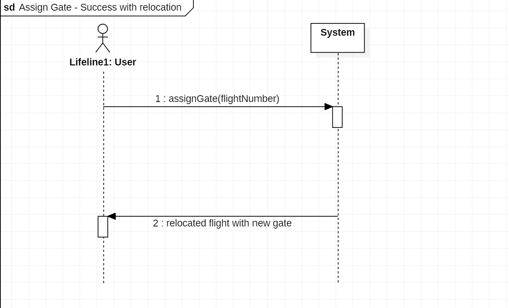

# Airport Gate Management System

This is a REST service that manages available gates for planes to park at an airport.

Certain gates are only available between certain times.  When a request for a gate arrives to the REST service
at a specific time, the service checks what gates are available at the current time as well as weather or not
they are currently in use.

## Use cases: 

**1. The REST service accepts a flight number and returns the assigned gate.**
   
_1.1 Success_
    
   
_1.2 If plane was already located on the gate, then plane is being relocated to a new gate._
    

_1.3 If a gate is not available, an appropriate response is returned from the REST service._
    
   
**2. The service accepts requests to update a gate as available.**
   
_1.1 Success_
    

_1.2 If passed gate id cannot be found, an appropriate response is returned from the REST service._
    

**3. Administrators are able to update the times that gates are available at.**
   
_1.1 Success_
    

_1.2 If passed gate id cannot be found, an appropriate response is returned from the REST service._
    

## Class diagram: 

